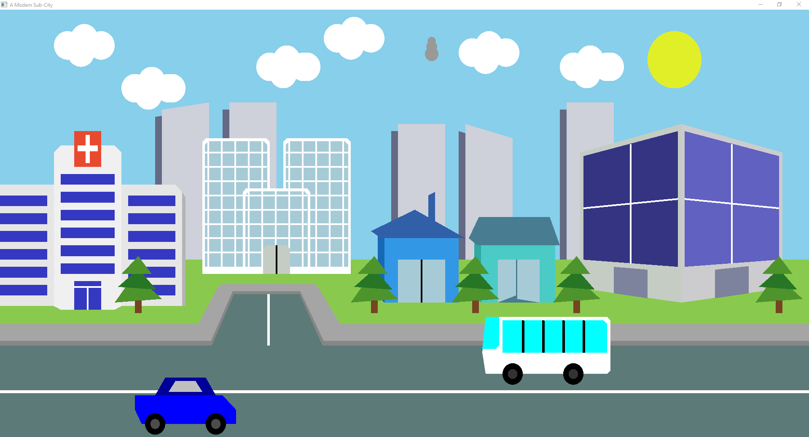
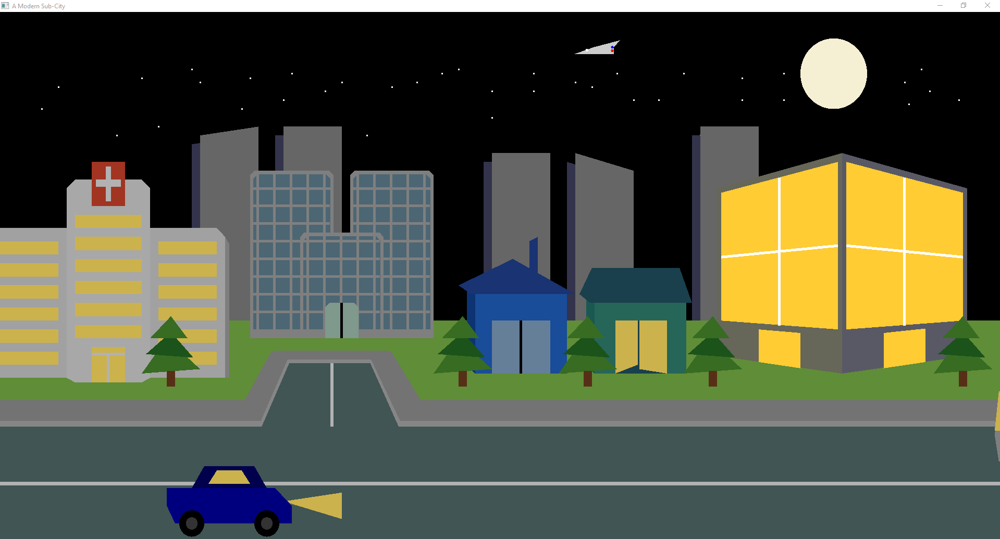

# Modern Sub-City - OpenGL Animated Scene

A retro-style animated cityscapes visualization project using OpenGL and GLUT, featuring a dynamic day/night cycle with traffic, moving clouds, and flying plane animations.


---

## 🎮 Features

- **Day/Night Cycle** - Switch between day (`d/D`) and night (`n/N`) modes
- **Dynamic Traffic** - Moving cars and buses with variable speeds
- **Animated Elements** - Clouds, smoke, and flying plane effects
- **City Scenery** - Buildings, trees, roads, sidewalks, and urban infrastructure
- **Real-time Controls** - Adjust traffic speed using keyboard shortcuts


*Day mode with blue sky, clouds, sun, and moving traffic*


*Night mode with stars, moon, and flying plane animation*

---

## 🖥️ Supported Platforms

- ✅ Linux (GLUT/OpenGL)
- ✅ Windows (FreeGLUT/OpenGL)

---

## ⚙️ Prerequisites

### Linux
```bash
sudo apt-get update
sudo apt-get install libglut-dev libglew-dev build-essential
```

### Windows
```powershell
# Install FreeGLUT via:
# 1. Download FreeGLUT from https://sourceforge.net/projects/freeglut/
# 2. Add to PATH and link during compilation

# Or use package manager:
winget install GLUT
```

---

## 🏗️ Building

### Using g++ (Simple)
```bash
g++ -o ModernSubCity main.cpp -lGL -lGLU -lglut
```

### With Compiler Flags
```bash
g++ -O2 -std=c++11 -Wall -o ModernSubCity \
    main.cpp scene*.h \
    -lGL -lGLU -lglut
```

---

## 🚀 Running

```bash
./ModernSubCity
```

**Or:**
```bash
./ModernSubCity Night          # Start with night mode
```

---

## ⌨️ Controls

| Key | Action |
|-----|--------|
| `d` / `D` | Day mode |
| `n` / `N` | Night mode |
| `↑` | Increase traffic speed |
| `↓` | Decrease traffic speed |

---

## 📐 Window Configuration

- **Resolution**: 1200 × 600 pixels
- **Position**: (100, 150) from top-left
- **Projection**: Orthographic 2D view

---

## 🔧 Code Structure

```
main.cpp           # Entry point, GLUT initialization
scene.h          # Scene composition & main loop
scene_back.h     # Sky, ground, celestial bodies
scene_buildings.h# Urban structures (large)
scene_trees.h    # Vegetation elements
scene_cars.h     # Traffic animations
scene_utils.h    # Helper functions (drawCircle, etc.)
scene_utils_inc    # Utility routines
scene_buildings_inc# Building definitions (auxiliary)
```

---

## 🛠️ Build Issues?

### "undefined reference to glutInit"
- Ensure GLUT development libraries are installed
- Add `-lglut` and `-lm` to compiler flags

### Windows-specific Errors
- Verify FreeGLUT is linked in PATH
- Consider using CMake with `FindGLUT.cmake`

---

## 📝 License

MIT License - Feel free to modify and distribute.

---

## 🎨 Credits

Retro OpenGL visualization project demonstrating:
- Procedural scene composition
- Time-based animation systems
- Day/night rendering cycle
- Interactive keyboard controls
